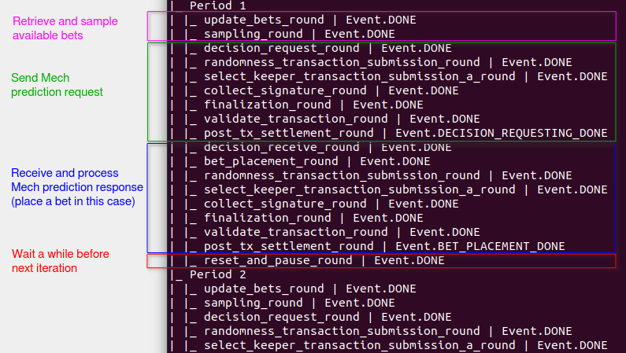
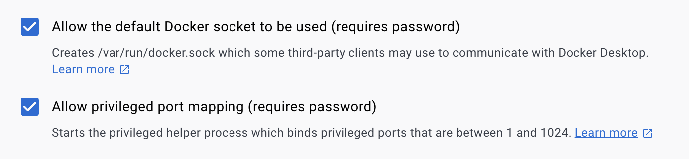
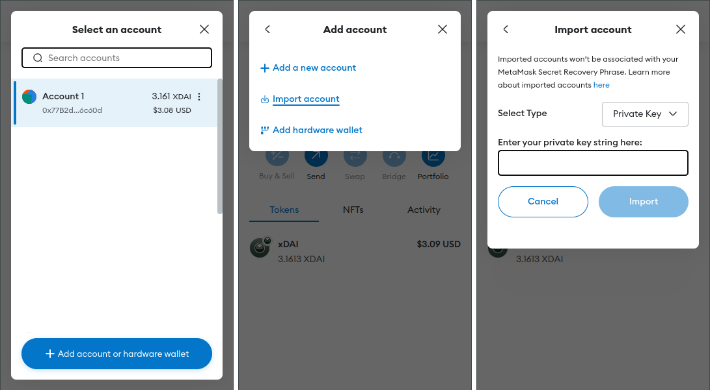

# trader-quickstart

A quickstart for the trader agent for AI prediction markets on Gnosis at https://github.com/valory-xyz/trader

## Compatible Systems

- Windows 10/11: WSL2 / Git BASH
- Mac ARM / Intel
- Linux
- Raspberry Pi 4

## System Requirements

Ensure your machine satisfies the requirements:

- Python `==3.10`
- [Poetry](https://python-poetry.org/docs/) `>=1.4.0`
- [Docker Engine](https://docs.docker.com/engine/install/) `<25.0.0`
- [Docker Compose](https://docs.docker.com/compose/install/)

## Resource Requirements

- You need xDAI on Gnosis Chain in one of your wallets.
- You need an RPC for your agent instance. We recommend [Nodies RPC](https://www.nodies.app/).
- (From release v0.16.0 onwards) You will need a Subgraph API key that can be obtained at [The Graph](https://thegraph.com/studio/apikeys/).

## Run the Service

### For Non-Stakers

Clone this repository locally and execute:

```bash
chmod +x run_service.sh
./run_service.sh
```

Answer `1) No staking` when prompted:

```text
Please, select your staking program preference
```

### For Stakers

> :warning: **Warning** <br />
> The code within this repository is provided without any warranties. It is important to note that the code has not been audited for potential security vulnerabilities.
> Using this code could potentially lead to loss of funds, compromised data, or asset risk.
> Exercise caution and use this code at your own risk. Please refer to the [LICENSE](./LICENSE) file for details about the terms and conditions.

Each staking program has different OLAS requirements. The script will check that your owner address meets the minimum required OLAS on the Gnosis Chain.

Clone this repository locally and execute:

```bash
chmod +x run_service.sh
./run_service.sh
```

Select your preferred staking program when prompted:

```text
Please, select your staking program preference
----------------------------------------------
1) No staking
   Your Olas Predict agent will still actively participate in prediction
   markets, but it will not be staked within any staking program.

2) Quickstart Beta - Hobbyist
   The Quickstart Beta - Hobbyist staking contract offers 100 slots for
   operators running Olas Predict agents with the quickstart. It is designed as
   a step up from Coastal Staker Expeditions, requiring 100 OLAS for staking.
   The rewards are also more attractive than with Coastal Staker Expeditions.

3) Quickstart Beta - Expert
   The Quickstart Beta - Expert staking contract offers 20 slots for operators
   running Olas Predict agents with the quickstart. It is designed for
   professional agent operators, requiring 1000 OLAS for staking. The rewards
   are proportional to the Quickstart Beta - Hobbyist.

...
```

Find below a diagram of the possible status a service can be in the staking program:


Services can become staked by invoking the `stake()` contract method, where service parameters and deposit amounts are verified. Staked services can call the `checkpoint()` method at regular intervals, ensuring liveness checks and calculating staking rewards. In case a service remains inactive beyond the specified `maxAllowedInactivity` time, it faces eviction from the staking program, ceasing to accrue additional rewards. Staked or evicted services can be unstaked by calling the `unstake()` contract method. They can do so after `minStakingDuration` has passed or if no more staking rewards are available.

 __Notes__:

- Staking is currently in a testing phase, so the number of trader agents that can be staked might be limited.
- Services are evicted after accumulating 2 consecutive checkpoints without meeting the activity threshold.  
- Currently, the minimum staking time is approximately 3 days. In particular, a service cannot be unstaked during the minimum staking period.
- Once a staking program is selected, you can reset your preference by stopping your agent by running ./stop_service.sh and then running the command

  ``` bash
  ./reset_staking.sh
  ```

  Keep in mind that your service must stay for `minStakingDuration` in a staking program (typically 3 days) before you can change to a new program.

### Service is Running

Once the command has completed, i.e. the service is running, you can see the live logs with:

```bash
docker logs trader_abci_0 --follow
```

To stop your agent, use:

```bash
./stop_service.sh
```

### Backups

Agent runners are recommended to create a [backup](https://github.com/valory-xyz/trader-quickstart#backup-and-recovery) of the relevant secret key material.

## Observe your agents

1. Use the `trades` command to display information about placed trades by a given address:

    ```bash
    cd trader; poetry run python ../trades.py --creator YOUR_SAFE_ADDRESS; cd ..
    ```

    Or restrict the search to specific dates by defining the "from" and "to" dates:

    ```bash
    cd trader; poetry run python ../trades.py --creator YOUR_SAFE_ADDRESS --from-date 2023-08-15:03:50:00 --to-date 2023-08-20:13:45:00; cd ..
    ```

2. Use the `report` command to display a summary of the service status:

   ```bash
   cd trader; poetry run python ../report.py; cd ..
   ```

3. Use this command to investigate your agent's logs:

    ```bash
    cd trader; poetry run autonomy analyse logs --from-dir trader_service/abci_build/persistent_data/logs/ --agent aea_0 --reset-db; cd ..
    ```

    For example, inspect the state transitions using this command:

    ```bash
    cd trader; poetry run autonomy analyse logs --from-dir trader_service/abci_build/persistent_data/logs/ --agent aea_0 --fsm --reset-db; cd ..
    ```

    This will output the different state transitions of your agent per period, for example:

    

    For more options on the above command run:

    ```bash
    cd trader; poetry run autonomy analyse logs --help; cd ..
    ```

    or take a look at the [command documentation](https://docs.autonolas.network/open-autonomy/advanced_reference/commands/autonomy_analyse/#autonomy-analyse-logs).

## Update between versions

Simply pull the latest script:

```bash
git pull origin
```

Remove the existing trader folder:

```bash
rm -rf trader
```

Then continue above with "Run the script".

## Change the password of your key files

> :warning: **Warning** <br />
> The code within this repository is provided without any warranties. It is important to note that the code has not been audited for potential security vulnerabilities.
>
> If you are updating the password for your key files, it is strongly advised to [create a backup](https://github.com/valory-xyz/trader-quickstart#backup-and-recovery) of the old configuration (located in the `./trader_runner` folder) before proceeding. This backup should be retained until you can verify that the changes are functioning as expected. For instance, run the service multiple times to ensure there are no issues with the new password before discarding the backup.

If you have started you script specifying a password to protect your key files, you can change it by running the following command:

```bash
cd trader; poetry run python ../scripts/change_keys_json_password.py ../.trader_runner --current_password <current_password> --new_password <new_password>; cd ..
```

This will change the password in the following files:

- `.trader_runner/keys.json`
- `.trader_runner/operator_keys.json`
- `.trader_runner/agent_pkey.txt`
- `.trader_runner/operator_pkey.txt`

If your key files are not encrypted, you must not use the `--current-password` argument. If you want to remove the password protection of your key files,
you must not specify the `--new-password` argument.

## Advice for Mac users

In Docker Desktop make sure that in `Settings -> Advanced` the following boxes are ticked



## Advice for Windows users using Git BASH

We provide some hints to have your Windows system ready to run the agent. The instructions below have been tested in Windows 11.

Execute the following steps in a PowerShell terminal:

1. Install [Git](https://git-scm.com/download/win) and Git Bash:

    ```bash
    winget install --id Git.Git -e --source winget
    ```

2. Install Python 3.10:

    ```bash
    winget install Python.Python.3.10
    ```

3. Close and re-open the PowerShell terminal.

4. Install [Poetry](https://python-poetry.org/docs/):

    ```bash
    curl.exe -sSL https://install.python-poetry.org | python -
    ```

5. Add Poetry to your user's path:

    ```bash
    $existingUserPath = (Get-Item -Path HKCU:\Environment).GetValue("PATH", $null, "DoNotExpandEnvironmentNames")

    $newUserPath = "$existingUserPath;$Env:APPDATA\Python\Scripts"

    [System.Environment]::SetEnvironmentVariable("Path", $newUserPath, "User")
    ```

6. Install [Docker Desktop](https://www.docker.com/products/docker-desktop/):

    ```bash
    winget install -e --id Docker.DockerDesktop
    ```

7. Log out of your Windows session and then log back in.

8. Open [Docker Desktop](https://www.docker.com/products/docker-desktop/) and leave it opened in the background.

Now, open a Git Bash terminal and follow the instructions in the "[Run the script](#run-the-script)" section as well as the subsequent sections. You might need to install Microsoft Visual C++ 14.0 or greater.

## Advanced usage

This chapter is for advanced users who want to further customize the trader agent's behaviour without changing the underlying trading logic.

##### Policy weights

This script automatically sets some default weights to the agent's policy as a warm start.
to help convergence and improve tool selection.
These data were obtained after many days of running the service and are set
[here](https://github.com/valory-xyz/trader-quickstart/blob/0f093ebbf0857b8484a017912c3992f00fbe1a29/run_service.sh#L133-L137).
As a result, the current weights are always deleted and replaced by this strategy
which is considered to boost the initial performance of the service.

However, you may have found better performing policy weights and would like to remove this logic.
It can easily be done, by removing this method call,
[here](https://github.com/valory-xyz/trader-quickstart/blob/0f093ebbf0857b8484a017912c3992f00fbe1a29/run_service.sh#L698),
in order to set your own custom warm start.
Setting your own custom weights can be done by editing the corresponding files in `.trader_runner`.
Moreover, you may store your current policy as a backup before editing those files, using the following set of commands:

```shell
cp ".trader_runner/available_tools_store.json" ".trader_runner/available_tools_store_$(date +"%d-%m-%Y")".json
cp ".trader_runner/policy_store.json" ".trader_runner/policy_store_$(date +"%d-%m-%Y")".json
cp ".trader_runner/utilized_tools.json" ".trader_runner/utilized_tools_$(date +"%d-%m-%Y")".json
```

##### Tool selection

Sometimes, a mech tool might temporarily return invalid results.
As a result, the service would end up performing mech calls without being able to use the response.
Assuming that this tool has a large reward rate in the policy weights,
the service might end up spending a considerable amount of xDAI before adjusting the tool's reward rate,
without making any progress.
If a tool is temporarily misbehaving, you could use an environment variable in order to exclude it.
This environment variable is defined
[here](https://github.com/valory-xyz/trader/blob/v0.8.0/packages/valory/services/trader/service.yaml#L109-L112)
and can be overriden by setting it anywhere in the `run_service.sh` script with a new value, e.g.:

```shell
IRRELEVANT_TOOLS=["some-misbehaving-tool", "openai-text-davinci-002", "openai-text-davinci-003", "openai-gpt-3.5-turbo", "openai-gpt-4", "stabilityai-stable-diffusion-v1-5", "stabilityai-stable-diffusion-xl-beta-v2-2-2", "stabilityai-stable-diffusion-512-v2-1", "stabilityai-stable-diffusion-768-v2-1"]
```

##### Environment variables

You may customize the agent's behaviour by setting these trader-specific environment variables.

| Name | Type | Default Value | Description |
| --- | --- | --- | --- |
| `ON_CHAIN_SERVICE_ID` | `int` | `null` | The ID of the on-chain service. |
| `OMEN_CREATORS` | `list` | `["0x89c5cc945dd550BcFfb72Fe42BfF002429F46Fec"]` | The addresses of the market creator(s) that the service will track. |
| `OPENING_MARGIN` | `int` | `300` | The markets opening before this margin will not be fetched. |
| `LANGUAGES` | `list` | `["en_US"]` | Filter questions by languages. |
| `SAMPLE_BETS_CLOSING_DAYS` | `int` | `10` | Sample the bets that are closed within this number of days. |
| `TRADING_STRATEGY` | `str` | `kelly_criterion_no_conf` | Trading strategy to use. |
| `USE_FALLBACK_STRATEGY` | `bool` | `true` | Whether to use the fallback strategy. |
| `BET_THRESHOLD` | `int` | `100000000000000000` | Threshold (wei) for placing a bet. A bet will only be placed if `potential_net_profit` - `BET_THRESHOLD` >= 0. |
| `PROMPT_TEMPLATE` | `str` | `With the given question "@{question}" and the 'yes' option represented by '@{yes}' and the 'no' option represented by '@{no}', what are the respective probabilities of 'p_yes' and 'p_no' occurring?` | The prompt template to use for prompting the mech. |
| `DUST_THRESHOLD` | `int` | `10000000000000` | Minimum amount (wei) below which a position's redeeming amount will be considered dust. |
| `POLICY_EPSILON` | `float` | `0.1` | Epsilon value for the e-Greedy policy for the tool selection based on tool accuracy. |
| `DISABLE_TRADING` | `bool` | `false` | Whether to disable trading. |
| `STOP_TRADING_IF_STAKING_KPI_MET` | `bool` | `true` | Whether to stop trading if the staking KPI is met. |
| `AGENT_BALANCE_THRESHOLD` | `int` | `10000000000000000` | Balance threshold (wei) below which the agent will stop trading and a refill will be required. |
| `REFILL_CHECK_INTERVAL` | `int` | `10` | Interval in seconds to check the agent balance, when waiting for a refill. |
| `FILE_HASH_TO_STRATEGIES_JSON` | `list` | `[["bafybeihufqu2ra7vud4h6g2nwahx7mvdido7ff6prwnib2tdlc4np7dw24",["bet_amount_per_threshold"]],["bafybeibxfp27rzrfnp7sxq62vwv32pdvrijxi7vzg7ihukkaka3bwzrgae",["kelly_criterion_no_conf"]]]` | A list of mapping from ipfs file hash to strategy names. |
| `STRATEGIES_KWARGS` | `list` | `[["bet_kelly_fraction",1.0],["floor_balance",500000000000000000],["bet_amount_per_threshold",{"0.0":0,"0.1":0,"0.2":0,"0.3":0,"0.4":0,"0.5":0,"0.6":60000000000000000,"0.7":90000000000000000,"0.8":100000000000000000,"0.9":1000000000000000000,"1.0":10000000000000000000}]]` | A list of keyword arguments for the strategies. |
| `USE_SUBGRAPH_FOR_REDEEMING` | `bool` | `true` | Whether to use the subgraph to check if a position is redeemed. |
| `USE_NEVERMINED` | `bool` | `false` | Whether to use Nevermined. |
| `SUBSCRIPTION_PARAMS` | `list` | `[["base_url", "https://marketplace-api.gnosis.nevermined.app/api/v1/metadata/assets/ddo"],["did", "did:nv:01706149da2f9f3f67cf79ec86c37d63cec87fc148f5633b12bf6695653d5b3c"],["escrow_payment_condition_address", "0x31B2D187d674C9ACBD2b25f6EDce3d2Db2B7f446"],["lock_payment_condition_address", "0x2749DDEd394196835199471027713773736bffF2"],["transfer_nft_condition_address", "0x659fCA7436936e9fe8383831b65B8B442eFc8Ea8"],["token_address", "0x1b5DeaD7309b56ca7663b3301A503e077Be18cba"], ["order_address","0x72201948087aE83f8Eac22cf7A9f2139e4cFA829"], ["nft_amount", "100"], ["payment_token","0x0000000000000000000000000000000000000000"], ["order_address", "0x72201948087aE83f8Eac22cf7A9f2139e4cFA829"],["price", "1000000000000000000"]]` | Parameters for the subscription. |

The rest of the common environment variables are present in the [service.yaml](https://github.com/valory-xyz/trader/blob/main/packages/valory/services/trader/service.yaml), which are customizable too.

##### Checking agents' health

You may check the health of the agents by querying the `/healthcheck` endpoint. For example:

```shell
curl -sL localhost:8716/healthcheck | jq -C
```

This will return a JSON output with the following fields:

| Field | Type | Criteria |
| --- | --- | --- |
| `seconds_since_last_transition` | float | The number of seconds passed since the last transition in the FSM. |
| `is_tm_healthy` | bool | `false` if more than `BLOCKS_STALL_TOLERANCE` (60) seconds have passed since the last begin block request received from the tendermint node. `true` otherwise. |
| `period` | int | The number of full cycles completed in the FSM. |
| `reset_pause_duration` | int | The number of seconds to wait before starting the next FSM cycle. |
| `rounds` | list | The last rounds (upto 25) in the FSM that happened including the current one. |
| `is_transitioning_fast` | bool | `true` if `is_tm_healthy` is `true` and `seconds_since_last_transition` is less than twice the `reset_pause_duration`. `false` otherwise. |

So, you can usually use `is_transitioning_fast` as a rule to check if an agent is healthly. To add a more strict check, you can also tune a threshold for the `seconds_since_last_transition` and rate of change of `period`, but that will require some monitoring to fine tune it.

## Backup and Recovery

When executed for the first time, the `run_service.sh` script creates a number of Gnosis chain accounts:

- one EOA account will be used as the service owner and agent operator,
- one EOA account will be used for the trading agent, and
- one smart contract account corresponds to a [Safe](https://app.safe.global/) wallet with a single owner (the agent account).

The addresses and private keys of the EOA accounts (plus some additional configuration) are stored within the folder `.trader_runner`. In order to avoid losing your assets, back up this folder in a safe place, and do not publish or share its contents with unauthorized parties.

You can gain access to the assets of your service as follows:

1. Ensure that your service is stopped by running `stop_service.sh`.
2. Ensure that you have a hot wallet (e.g., [MetaMask](https://metamask.io/)) installed and set up in your browser.
3. Import the two EOAs accounts using the private keys. In MetaMask, select "Add account or hardware wallet" &#8594; "Import account" &#8594; "Select Type: Private Key", and enter the private key of the owner/operator EOA account (located in `.trader_runner/operator_pkey.txt`):
    

4. Repeat the same process with the agent EOA account (private key located in `.trader_runner/agent_pkey.json`).

Now, you have full access through the hot wallet to the EOAs addresses associated to your service and you can transfer their assets to any other address. You can also manage the assets of the service Safe through the DApp https://app.safe.global/, using the address located in the file `.trader_runner/service_safe_address.txt`.

## Terminate your on-chain service

If you wish to terminate your on-chain service (and receive back the staking/bonding funds to your owner/operator address in case your service is staked) execute:

```bash
./stop_service.sh
./terminate_on_chain_service.sh
```

## RPC-related Error Messages

When updating the service, you may need to re-run the script if you obtain any of the following error messages:

```Error: Service terminatation failed with following error; ChainTimeoutError(Timed out when waiting for transaction to go through)

Error: Service unbonding failed with following error; ChainTimeoutError(Timed out when waiting for transaction to go through)

Error: Component mint failed with following error; ChainTimeoutError(Timed out when waiting for transaction to go through)

Error: Service activation failed with following error; ChainTimeoutError(Timed out when waiting for transaction to go through)

Error: Service deployment failed with following error; ChainTimeoutError(Timed out when waiting for transaction to go through)

Error: Service terminatation failed with following error; ChainInteractionError({'code': -32010, 'message': 'AlreadyKnown'})
```

## Build deployments without executing the service

The script builds both a Docker Compose deployment (on `./trader/trader_service/abci_build`) and a Kubernetes deployment (on `./trader/trader_service/abci_build_k8s`). Then, by default, the script will launch the local Docker Compose deployment. If you just want to build the deployment without executing the service (for example, if you are deploying to a custom Kubernetes cluster), then execute the script as

```bash
    ./run_service.sh --build-only
```
